<div align="center">

<picture>
  <source media="(prefers-color-scheme: dark)" srcset="site/assets/brand/lockup-dark.svg">
  
</picture>

<br><br>

### Sealed, anonymous-first intake for sensitive claims

Harassment, misconduct, and whistleblowing reports don't get made when people
don't trust the channel. **kilio** lets anyone report **without an account and
without an email**, seals every submission to your keys **before it leaves
their device**, and still supports a two-way conversation — so you can ask
follow-ups and give an outcome without ever learning who they are, unless they
choose to tell you.

It is **standalone and cross-platform** — a single Rust binary plus a desktop
app, on **macOS, Linux, and Windows**. No SaaS backend, no cloud account, no
dependency on any hosted service. What you run is what you own — and what you
run **cannot read the claims it stores**.

<br>

<!-- Plain-text badges on purpose: rendering this README triggers no external
     image fetches — the same no-default-network-calls ethos as the app. -->
<sub>
<a href="LICENSE-MIT">MIT</a> OR <a href="LICENSE-APACHE">Apache-2.0</a>
&nbsp;·&nbsp; Rust
&nbsp;·&nbsp; Tauri 2
&nbsp;·&nbsp; macOS · Linux · Windows
&nbsp;·&nbsp; HPKE sealed-at-source
&nbsp;·&nbsp; standalone · no cloud
</sub>

<br><br>

[Quick start](#quick-start) ·
[What it is](#what-is-kilio) ·
[How it works](#how-it-works) ·
[Screenshots](#screenshots) ·
[Privacy model](#privacy-model) ·
[Architecture](#architecture) ·
[Docs](docs/)

<br><br>

<picture>
  <source media="(prefers-color-scheme: dark)" srcset="docs/screenshots/reporter-landing-dark.png">
  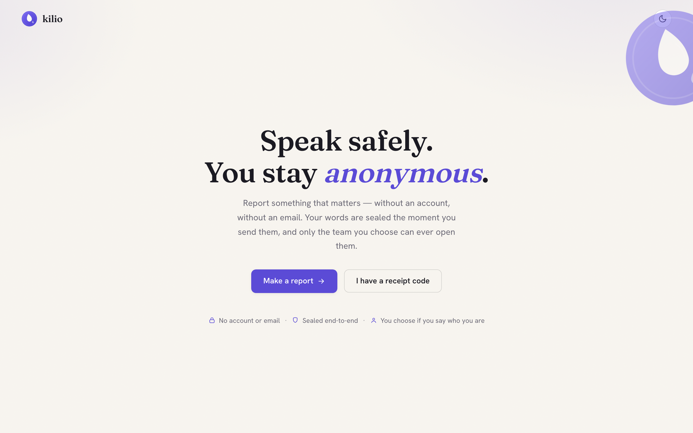
</picture>

</div>

---

## What is kilio?

kilio replaces the "email HR" / third-party ethics-hotline model — the one where
the reporter has to trust a vendor's cloud, hand over their identity to begin,
and hope nobody in the middle is reading along.

The difference from every incumbent: **there is no central server that can read
anything.** An organization runs its own kilio instance — a laptop with a
tunnel, a small VPS, a Raspberry Pi, anything that runs the binary. A reporter
opens the public intake page, writes their claim, and their browser HPKE-seals
it to the destination team's public key. The instance — and any tunnel or relay
between them — only ever stores **ciphertext**. It is decrypted only inside a
handler's app, with a key the server never holds.

kilio is **completely standalone**. It depends on no hosted service and no
account — not even ours. It runs the same on macOS, Linux, and Windows.
(Optional, off-by-default seams let it reach further when you want them —
see [Architecture](#architecture) — but nothing about the core needs them.)

The reporter's only identity is a **12-word receipt passphrase** minted at
submission. It derives a per-claim keypair, so they can return, read replies,
and add details — including, if and when *they* decide, their contact info —
without ever creating an account.

> **Status: 0.1.0 — early.** The sealed-crypto core (`kilio-seal`) and the
> sealed store + branch scoping (`kilio-core`) have landed and are tested,
> along with the full design (`decisions.md`). The server, CLI, web surfaces,
> and Tauri app are in progress — see the [roadmap](ROADMAP.md).

---

## How it works

A reporter never authenticates. A handler always does. Between them runs a
sealed, anonymous, two-way channel keyed only by a secret the reporter holds.

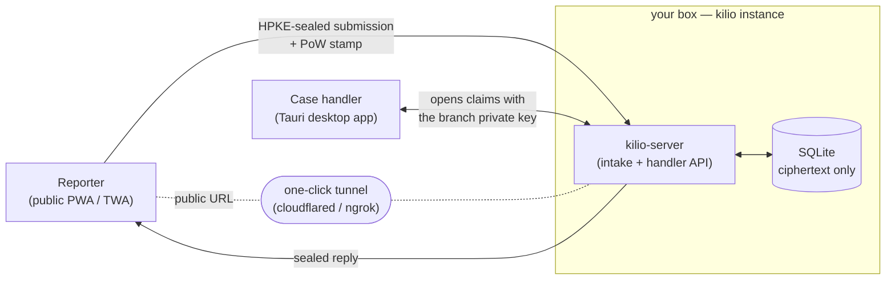

1. **Seal at source.** The reporter's device encrypts the claim to the branch's
   public key. The host stores ciphertext it cannot read.
2. **Receipt passphrase.** 12 words are the reporter's only identity; they
   derive a per-claim keypair (memory-hard) for return visits and sealed
   replies. No email, no account, no recovery (by design).
3. **Anonymous two-way channel.** Handlers reply sealed to the claim key;
   reporters prove control by signing with it. Nobody learns who they are.
4. **Go public with no infra.** Expose the intake page through a tunnel from a
   laptop, or run behind a reverse proxy / Tor — your choice.

---

## Screenshots

The **reporter** surface is a calm, public, anonymous intake page. The
**handler** surface is the case-worker desktop app. kilio ships both light and
dark — the shots below follow your GitHub theme.

<table>
<tr>
<td width="50%" valign="top">
<picture><source media="(prefers-color-scheme: dark)" srcset="docs/screenshots/reporter-new-dark.png">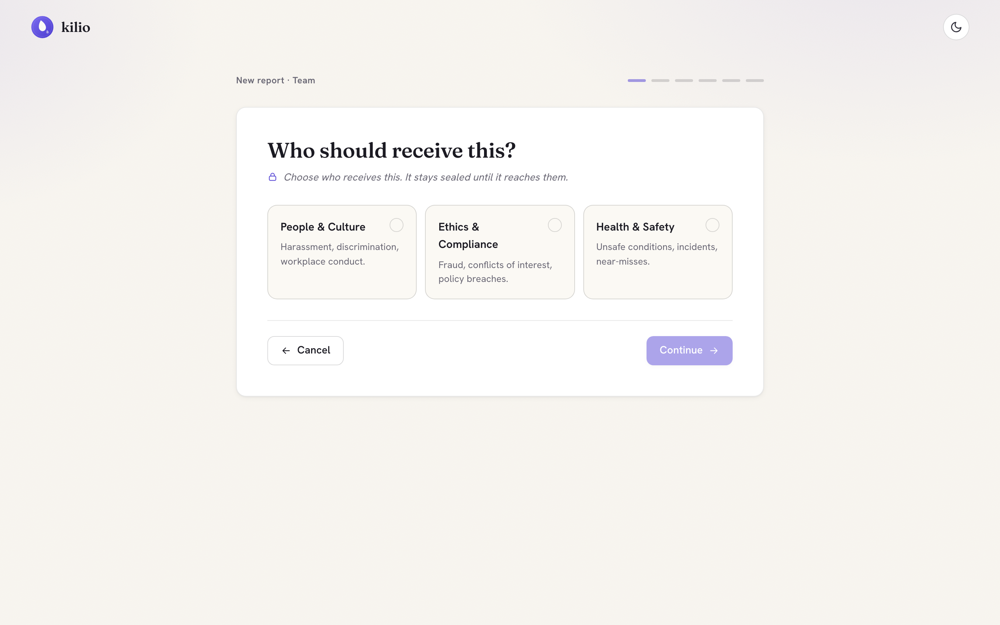</picture>
<sub><em>Make a report — a gentle, stepped form. No account, no email.</em></sub>
</td>
<td width="50%" valign="top">
<picture><source media="(prefers-color-scheme: dark)" srcset="docs/screenshots/reporter-receipt-dark.png">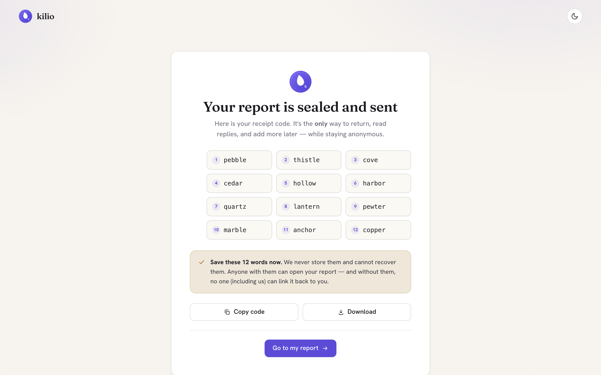</picture>
<sub><em>The receipt passphrase — the only way back, and the only identity.</em></sub>
</td>
</tr>
<tr>
<td width="50%" valign="top">
<picture><source media="(prefers-color-scheme: dark)" srcset="docs/screenshots/reporter-thread-dark.png">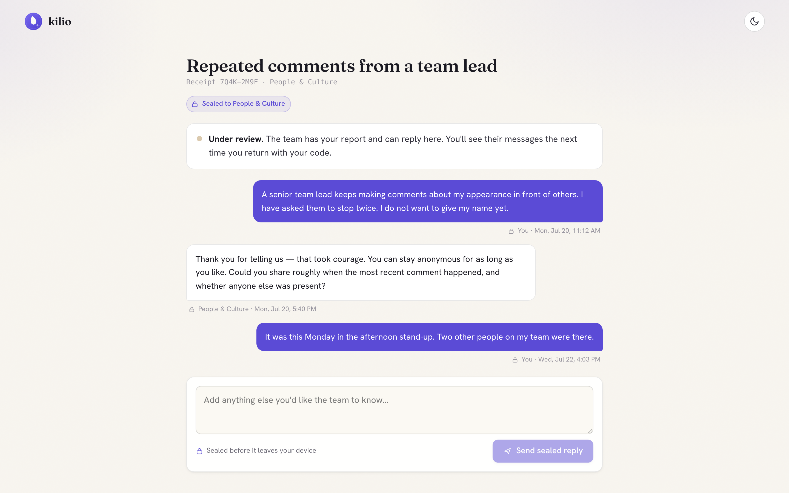</picture>
<sub><em>A sealed, anonymous two-way thread with the team.</em></sub>
</td>
<td width="50%" valign="top">
<picture><source media="(prefers-color-scheme: dark)" srcset="docs/screenshots/handler-case-dark.png">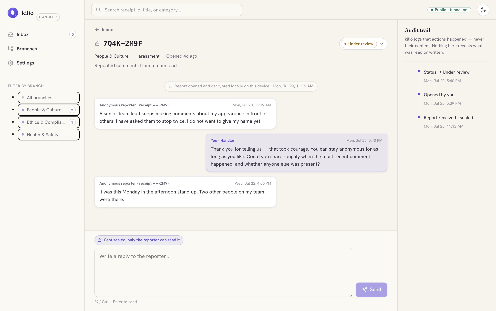</picture>
<sub><em>Handler case view — decrypted thread, status, content-free audit.</em></sub>
</td>
</tr>
</table>

<picture><source media="(prefers-color-scheme: dark)" srcset="docs/screenshots/handler-inbox-dark.png">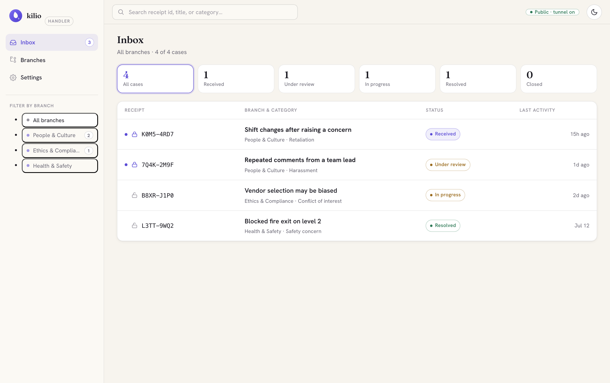</picture>

<sub><em>Handler inbox — triage sealed reports across branches; the reporter is always anonymous.</em></sub>

### Fully responsive — on mobile, in the dark

Both surfaces are built mobile-first and ship light **and** dark. On a phone the
handler's sidebar collapses to a drawer and the case view becomes a chat.

<p align="center">
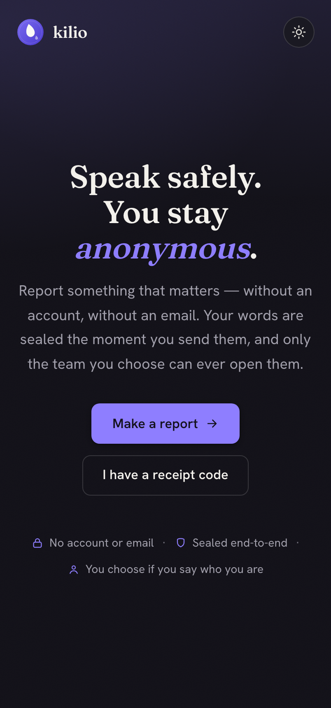
&nbsp;&nbsp;
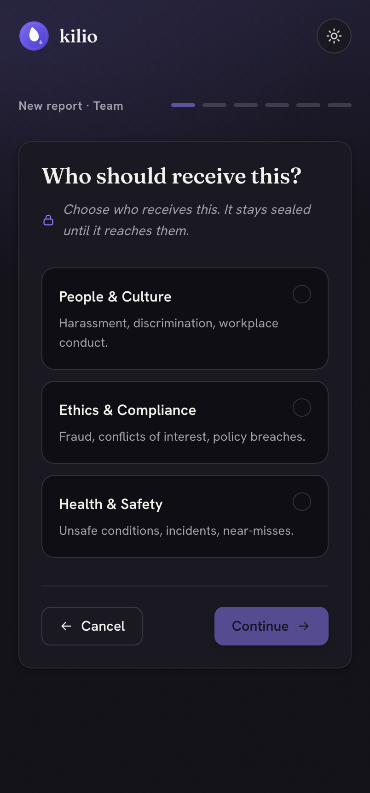
&nbsp;&nbsp;
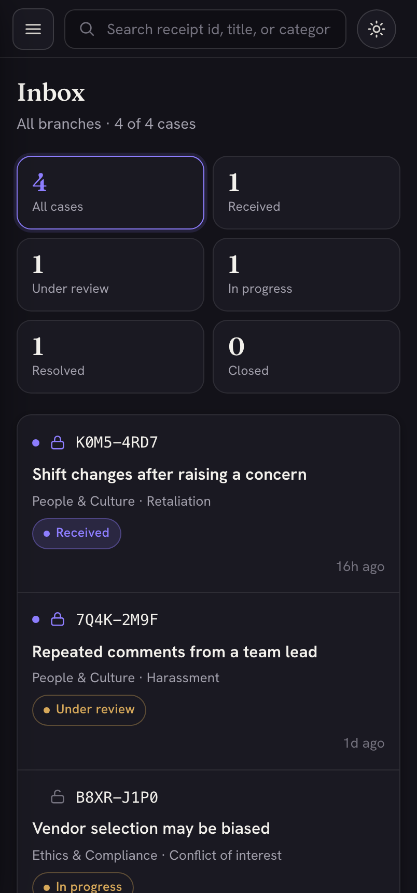
&nbsp;&nbsp;
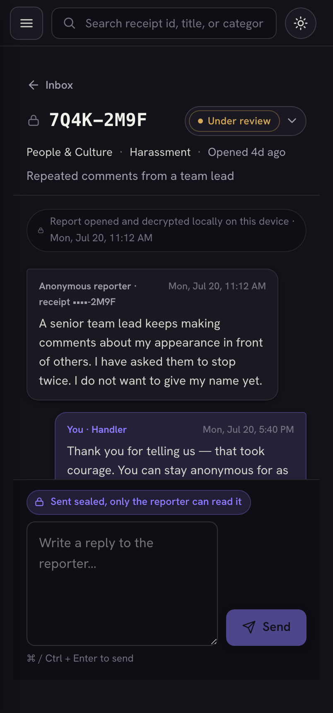
</p>

<sub align="center"><em>Reporter and handler surfaces on mobile, dark mode — anonymous submit, and a case handled on the go.</em></sub>

---

## Privacy model

These four properties are non-negotiable (full detail in
[docs/SECURITY.md](docs/SECURITY.md) and `decisions.md` §3):

| Property | What it means |
|----------|---------------|
| **Sealed at source** | Claims are HPKE-sealed in the reporter's browser to the branch key. Host, tunnel, and relay see only ciphertext. |
| **No mandatory identity** | No name, email, or contact detail is ever required. The receipt passphrase is the only identity. |
| **Anonymous two-way channel** | Sealed replies both directions, bound to a secret only the reporter holds. |
| **Metadata minimization** | No IP/User-Agent logging on the intake path, size-bucketed ciphertext, an anonymous proof-of-work cold-contact gate instead of accounts, no third-party assets. |

Primitives are RFC 9180 HPKE (DHKEM-X25519 / HKDF-SHA256 / ChaCha20Poly1305)
via the audited `hpke` crate, Ed25519, Argon2id, and BLAKE3. No primitive is
hand-rolled; only their composition is ours.

---

## Quick start

> **Status: 0.1.0.** Today you can build the workspace and run the sealed-crypto
> core's test suite. The runnable operator flow lands as the surfaces do.

### Prerequisites
- **Rust** stable (1.85+). **Node** 20+ and the Tauri prerequisites for the
  desktop app (as surfaces land).

### Build & test

```bash
git clone https://github.com/vul-os/kilio
cd kilio
cargo build --workspace
cargo test -p kilio-seal      # the sealed-submission crypto spine
```

### Intended operator flow (in progress)

```bash
kilio init                    # generate a branch keypair (sealed at rest)
kilio serve --port 8787       # intake + handler API, serves the embedded PWA
kilio tunnel start            # expose the intake page publicly, no fixed infra
```

---

## Architecture

One Rust workspace, one shared web frontend, three ways to run it.

| Crate / app | Role |
|-------------|------|
| `kilio-seal` | Sealed-submission crypto: HPKE seal-to-branch, receipt→per-claim keys, sealed-sender envelope, PoW gate. Native **and** `wasm32`. ✅ |
| `kilio-core` | Domain model, SQLite sealed store, the seams, branch scoping. ✅ |
| `kilio-server` | axum: public intake API + handler API + embedded PWA + tunnel control. 🚧 |
| `kilio-cli` | `kilio init / serve / tunnel / branch`. 🚧 |
| `apps/desktop` | Tauri v2 handler app; opens claims locally with the branch key. 🚧 |
| `web/` | React/JSX PWA/TWA — reporter + handler surfaces built (Sanctuary UI); `kilio-seal` WASM wiring next. 🚧 |

Three **seams** (thin interface, local default, adapter wired only at the
composition root — the ofisi pattern):

- **Delivery** — `Local` (default, standalone) · `Kotva` (decentralized,
  content-blind rendezvous mailbox for cross-org forwarding).
- **Reachability** — `LocalOnly` · `SubprocessTunnel` (cloudflared/ngrok) ·
  `Ephor` (wede sovereign tunnel).
- **Identity / deploy mode** — `standalone` · `os` (behind a Vulos OS gateway,
  fail-closed boot gate).

Full contract: [docs/ARCHITECTURE.md](docs/ARCHITECTURE.md). Design rationale
and threat model: [`decisions.md`](decisions.md).

---

## Docs

- [Getting started](docs/GETTING-STARTED.md) — build, test, and the operator flow.
- [Architecture](docs/ARCHITECTURE.md) — crates, surfaces, seams, data flow.
- [Security model](docs/SECURITY.md) — the privacy spine, threat model, crypto.
- [Design decisions](decisions.md) · [Roadmap](ROADMAP.md) · [Changelog](CHANGELOG.md)

---

## License & contributing

kilio is licensed **MIT OR Apache-2.0** — at your option (see
[LICENSE-MIT](LICENSE-MIT) and [LICENSE-APACHE](LICENSE-APACHE)), matching every
sibling in the vulos suite. Contributions welcome — see
[CONTRIBUTING.md](CONTRIBUTING.md). Found a vulnerability? See
[SECURITY.md](SECURITY.md).

---

<p align="center">
  <sub><b>kilio</b> is free, standalone software — it runs on its own and needs no hosted service.<br>
  Part of the <a href="https://vulos.org">vulos</a> family of self-hostable apps, but independent of it by design.</sub>
</p>
