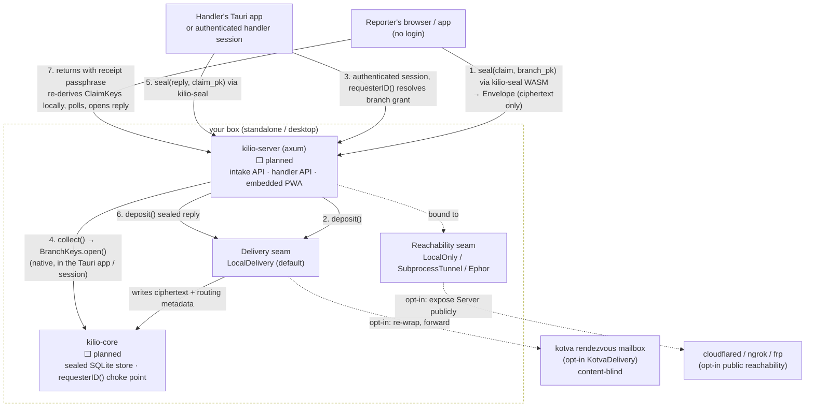

# kilio Architecture

kilio is one Rust workspace, one shared web frontend, three ways to run it. This
document maps the crates and surfaces, the three pluggable seams, how a sealed
submission actually flows, and the branch-scoping model that keeps one
deployment safely multi-branch. For *why* each of these choices was made, read
[`decisions.md`](../decisions.md) — this document describes the *shape*, that
one records the *reasoning*.

> **Status honesty up front.** Only `kilio-seal` is built and tested today.
> `kilio-core`, `kilio-server`, `kilio-cli`, `apps/desktop`, and `web/` are
> specified in [decisions.md §9](../decisions.md#9-build-order) but not yet
> written. Every component below is marked ✅ built or ⬜ planned — do not read
> a diagram box as a shipped feature.

---

## Crate / component map

```
kilio/
  crates/
    kilio-seal     ✅ built   sealed-submission crypto. native + wasm32. THE spine.
    kilio-core     ⬜ planned domain model, sealed store, seams, requesterID choke point.
    kilio-server   ⬜ planned axum: intake API + handler API + embedded PWA + tunnel control.
    kilio-cli      ⬜ planned `kilio init | serve | tunnel | branch`
  apps/
    desktop/       ⬜ planned Tauri v2 handler app (embeds kilio-core, decrypts natively).
  web/             ⬜ planned React/JSX PWA — reporter + handler surfaces, seals via WASM.
  docs/
```

| Crate/surface | Role | Depends on | Status |
|---|---|---|---|
| `kilio-seal` | HPKE seal/open, receipt→claim-key derivation, sealed-sender envelope, PoW. No I/O, no storage, no framework. | `hpke`, `ed25519-dalek`, `argon2`, `bip39`, `blake3`, `ciborium` | ✅ built, unit-tested (`cargo test -p kilio-seal`) |
| `kilio-core` | Domain model (Branch/Claim/Message/Handler/AuditEvent), SQLite sealed store, `Delivery`/`Reachability`/`Identity` seam traits with local defaults, the `requesterID()` choke point and `branch_key()` builder. No web framework. | `kilio-seal` | ⬜ planned |
| `kilio-server` | axum HTTP: intake API (reporter-facing, no auth), handler API (session-gated), embeds the built PWA, owner-gated tunnel start/stop. | `kilio-core` | ⬜ planned |
| `kilio-cli` | `kilio init` (generate a branch key), `kilio serve`, `kilio tunnel`, `kilio branch` (add/list branches). | `kilio-core`, `kilio-server` | ⬜ planned |
| `apps/desktop` | Tauri v2 handler app. Embeds `kilio-core` directly (native Rust, not WASM) so a single officer can decrypt and answer claims on a laptop with the subprocess tunnel as the default reachability path. | `kilio-core`, `kilio-seal` | ⬜ planned |
| `web/` | React/JSX PWA. Reporter surface (submit, return-with-passphrase, poll) and handler surface (inbox, reply) as one installable app. Sealing runs client-side via `kilio-seal` compiled to `wasm32`. | `kilio-seal` (wasm32) | ⬜ planned |

**Why Rust once, everywhere.** `kilio-seal` compiles natively (server, CLI,
Tauri) and to `wasm32` (the reporter's browser), so the sealing code exists
**exactly once** and is never reimplemented per surface — see decisions.md §2
for why that single-implementation property is the whole reason Rust was
picked here.

---

## The two surfaces

kilio has exactly two audiences, and they never share a session:

| Surface | Who | What it can do | Sees plaintext? |
|---|---|---|---|
| **Reporter surface** | anonymous, no login | submit a claim, generate/re-enter a receipt passphrase, poll a claim, read/send messages on *their own* claim | Yes, but only their own claim — the client seals/opens locally |
| **Handler surface** | an authenticated handler (triager/investigator/admin) for one or more branches | open the branches they're granted, read/decrypt claims, reply | Yes, but only for branches they're granted — server never widens this |

Both surfaces are served by the same `kilio-server` binary and the same
`web/` PWA bundle in `standalone`/`os` mode; the handler surface is also
available natively in `apps/desktop` (Tauri) for a single-officer deployment
that never needs a server at all.

---

## The three seams

The ofisi rule, carried over verbatim: **core defines the interface and
compiles a local default; the fancy adapter is wired only in `main`, and core
never imports it.** Remove any adapter and the standalone build still works.

### 1. `Delivery` — where a sealed envelope ends up

```rust
trait Delivery {
    async fn deposit(&self, branch_id: &BranchId, envelope: &Envelope) -> Result<Receipt>;
    async fn collect(&self, branch_id: &BranchId, since: Cursor) -> Result<Vec<Envelope>>;
}
```

| Implementation | Default? | What it does |
|---|---|---|
| `LocalDelivery` | ✅ default | Writes the sealed envelope to the local SQLite store. Zero external dependencies — what `standalone`/`desktop` use. |
| `KotvaDelivery` | opt-in | Deposits the envelope as an opaque, content-blind blob to a kotva rendezvous mailbox (`POST {relay}/mailbox/{to}`) — the working ephor Go relay + `@vulos/relay-client`. Used to forward claims to an external ombudsman or across orgs with no shared server. The envelope is already kotva-MOTE-shaped, so this is a re-wrap, never a re-encrypt. |

### 2. `Reachability` — making the local app publicly reachable

Mirrors wede's `Provider` interface (`start`/`stop`/`public_url`/`snapshot`):

```rust
trait Reachability {
    async fn start(&self, local_addr: SocketAddr) -> Result<PublicUrl>;
    async fn stop(&self) -> Result<()>;
    fn snapshot(&self) -> TunnelStatus;   // token always redacted
}
```

| Implementation | Default? | What it does |
|---|---|---|
| `LocalOnly` | ✅ default | Binds `127.0.0.1`, no exposure. Dev, or behind a reverse proxy the org already runs. |
| `SubprocessTunnel` | ✅ working "click to go public" path | Spawns a detected tunnel binary (`cloudflared` / `ngrok` / `frp`) pinned to the loopback listen address, parses the assigned public URL. The honest, runnable-today path — wede's built-in relay needs a relay *server* that isn't in-tree here yet. |
| `Ephor` | ⬜ stubbed seam | The wede sovereign reverse-tunnel agent, wired the day an Ephor server is available to point at. |

**SSRF guard, non-negotiable (carried from wede):** whichever provider runs,
it proxies to exactly **one** configured loopback address, re-checked before
every connection. The inbound request's Host/URL never chooses the target.

### 3. `Identity` / deploy mode

One typed `DEPLOY_MODE` enum (the ofisi pattern), three values:

| Mode | Who runs it | Reachability | Identity |
|---|---|---|---|
| `desktop` | one officer, on a laptop | subprocess tunnel | local owner |
| `standalone` | org, on a box/VPS | tunnel or reverse proxy | local admin(s), Argon2id password → session |
| `os` | behind a Vulos OS gateway | gateway | gateway-brokered, server-verified session |

`os` mode **refuses to boot without a configured auth verifier** — the ofisi
fail-closed boot gate. It never silently collapses every handler down to one
identity.

---

## Data flow of a sealed submission

The vertical slice decisions.md §9 calls out as the thing that must work
first: **anonymous sealed submit → receipt passphrase → handler decrypts in
inbox → sealed reply → reporter returns with passphrase and reads it.**



**What never happens in this diagram:** the server, the tunnel, the kotva
relay, and the DB only ever handle `Envelope` values — cleartext routing
fields (`kind`, `recipient` tag, `size_bucket`) plus HPKE ciphertext. No box
in this flow except the reporter's own device and the handler's own
Tauri app / authenticated session ever holds a plaintext claim body.

---

## Branch scoping (the ofisi multi-branch pattern)

One deployment can serve many branches (offices, regions, a "global" catch-all).
Copied from ofisi in spirit, down to the two primitives:

- **One scoped-key builder.** `branch_key(branch_id, name) → "<branch_id>/<name>"`,
  with segment sanitization (no `/`, `\`, `..`). Every stored object —
  claim, message, attachment — is addressed through this single function.
  This is the *only* isolation primitive; there is no second path that
  reaches storage.
- **One `requesterID()` choke point.** A handler's branch access is resolved
  **server-side**, from their authenticated session, never from a client
  header. A handler for branch A cannot read branch B's claims. Denied reads
  return `404`, never `403` — kilio never confirms that a claim exists to a
  handler who isn't scoped to see it.
- **Reporters choose their branch at submission** (or "global"), and the
  claim is HPKE-sealed to *that* branch's public key. Even a misrouted claim
  is cryptographically unreadable by the wrong team — branch scoping isn't
  only an access-control check, it's baked into the ciphertext.

Both primitives live in `kilio-core` (⬜ planned) once it exists; `kilio-seal`
already supplies the cryptographic half (`seal_to_branch` binds the
destination branch's key into the HPKE recipient and the AAD — see
[`envelope.rs`](../crates/kilio-seal/src/envelope.rs)), so branch scoping is
enforced twice: once by the server's `requesterID()` check, and once
unconditionally by the math, even if the server check were ever bypassed.

---

## Related documents

- [`decisions.md`](../decisions.md) — the authoritative design record. Read
  before touching crypto or seams.
- [`SECURITY.md`](SECURITY.md) — the privacy spine, threat model, and crypto
  primitives in detail.
- [`GETTING-STARTED.md`](GETTING-STARTED.md) — build/test today, intended
  operator flow once the rest lands.
- [`../ROADMAP.md`](../ROADMAP.md) — phased build order and open questions.
