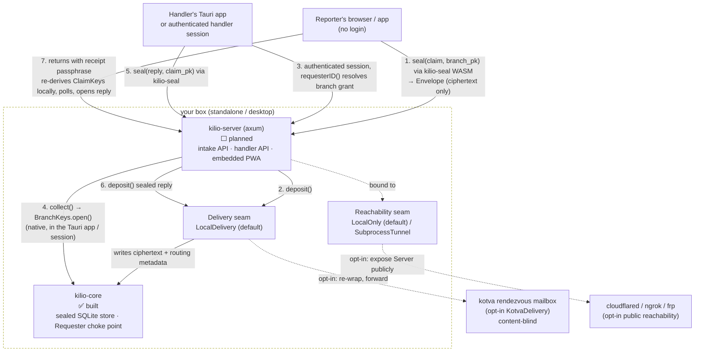

# kilio Architecture

kilio is one Rust workspace, one shared web frontend, three ways to run it. This
document maps the crates and surfaces, the three pluggable seams, how a sealed
submission actually flows, and the branch-scoping model that keeps one
deployment safely multi-branch. For *why* each of these choices was made, read
[`decisions.md`](../decisions.md) — this document describes the *shape*, that
one records the *reasoning*.

> **Status honesty up front.** `kilio-seal` and `kilio-core` are built and
> tested today; `web/` is built as UI on mock data, with no `kilio-seal` WASM
> wiring yet. `kilio-server`, `kilio-cli`, and `apps/desktop` are specified in
> [decisions.md §9](../decisions.md#9-build-order) but not yet written — the
> `apps/` directory is empty. Every component below is marked ✅ built or
> ⬜ planned — do not read a diagram box as a shipped feature.

---

## Crate / component map

```
kilio/
  crates/
    kilio-seal     ✅ built   sealed-submission crypto + branch key pinning. native + wasm32.
    kilio-core     ✅ built   domain model, sealed store, seams, Requester choke point.
    kilio-server   ⬜ planned axum: intake API + handler API + embedded PWA + tunnel control.
    kilio-cli      ⬜ planned `kilio init | serve | tunnel | branch`
  apps/
    desktop/       ⬜ planned Tauri v2 handler app (embeds kilio-core, decrypts natively).
  web/             🚧 partial React/JSX PWA — surfaces built on mock data; WASM wiring pending.
  docs/
```

| Crate/surface | Role | Depends on | Status |
|---|---|---|---|
| `kilio-seal` | HPKE seal/open, receipt→claim-key derivation, sealed-sender envelope, PoW, and branch key **pinning** (`BranchPin`, signed descriptors, rekey certificates). No I/O, no storage, no framework. | `hpke`, `ed25519-dalek`, `argon2`, `bip39`, `blake3`, `ciborium` | ✅ built, unit-tested (`cargo test -p kilio-seal`) |
| `kilio-core` | Domain model (Branch/Claim/Message/AuditEvent), SQLite sealed store, `Delivery`/`Reachability` seam traits with local defaults, the `Requester` choke point and `branch_scoped_key()` builder. No web framework. | `kilio-seal` | ✅ built, unit-tested (`cargo test -p kilio-core`) |
| `kilio-server` | axum HTTP: intake API (reporter-facing, no auth), handler API (session-gated), embeds the built PWA, owner-gated tunnel start/stop. | `kilio-core` | ⬜ planned |
| `kilio-cli` | `kilio init` (generate a branch key), `kilio serve`, `kilio tunnel`, `kilio branch` (add/list branches). | `kilio-core`, `kilio-server` | ⬜ planned |
| `apps/desktop` | Tauri v2 handler app. Embeds `kilio-core` directly (native Rust, not WASM) so a single officer can decrypt and answer claims on a laptop with the subprocess tunnel as the default reachability path. | `kilio-core`, `kilio-seal` | ⬜ planned |
| `web/` | React/JSX PWA. Reporter surface (submit, return-with-passphrase, poll) and handler surface (inbox, reply) as one installable app. Sealing is to run client-side via `kilio-seal` compiled to `wasm32`. | `kilio-seal` (wasm32) | 🚧 both surfaces built and responsive, on mock data; WASM wiring, service worker, and TWA manifest pending |

**Why Rust once, everywhere.** `kilio-seal` compiles natively (server, CLI,
Tauri) and to `wasm32` (the reporter's browser), so the sealing code exists
**exactly once** and is never reimplemented per surface — see decisions.md §2
for why that single-implementation property is the whole reason Rust was
picked here.

---

## The two surfaces

kilio has exactly two audiences, and they never share a session:

| Surface | Who | What it can do | Sees plaintext? |
|---|---|---|---|
| **Reporter surface** | anonymous, no login | submit a claim, generate/re-enter a receipt passphrase, poll a claim, read/send messages on *their own* claim | Yes, but only their own claim — the client seals/opens locally |
| **Handler surface** | an authenticated handler (triager/investigator/admin) for one or more branches | open the branches they're granted, read/decrypt claims, reply | Yes, but only for branches they're granted — server never widens this |

Both surfaces are served by the same `kilio-server` binary and the same
`web/` PWA bundle in `standalone`/`os` mode; the handler surface is also
available natively in `apps/desktop` (Tauri) for a single-officer deployment
that never needs a server at all.

---

## The three seams

The diwan rule, carried over verbatim: **core defines the interface and
compiles a local default; the fancy adapter is wired only in `main`, and core
never imports it.** Remove any adapter and the standalone build still works.

### 1. `Delivery` — where a sealed envelope ends up

The local store write always happens; `Delivery` is the optional *extra* hop.

```rust
// crates/kilio-core/src/delivery.rs — as implemented
pub trait Delivery: Send + Sync {
    fn forward(&self, claim_id: &ClaimId, env: &Envelope) -> Result<(), CoreError>;
    fn label(&self) -> &'static str;
}
```

| Implementation | Default? | What it does | Status |
|---|---|---|---|
| `LocalDelivery` | ✅ default | Forwards nowhere — the sealed claim lives only in the local store. Zero external dependencies. | ✅ built |
| `KotvaDelivery` | opt-in | Carries the target relay + recipient for a kotva rendezvous mailbox (`POST {relay}/mailbox/{to}`), content-blind. The envelope is already kotva-MOTE-shaped, so this is a re-wrap, never a re-encrypt. | 🚧 seam only — `forward()` returns `CoreError::Unsupported`; the async mailbox deposit lands with `kilio-server` |

### 2. `Reachability` — making the local app publicly reachable

Mirrors wede's `Provider` interface (`start`/`stop`/`snapshot`), synchronously —
starting a tunnel is a one-shot state change, not a stream:

```rust
// crates/kilio-core/src/reachability.rs — as implemented
pub trait Reachability: Send {
    fn start(&mut self, local_addr: SocketAddr) -> Result<String, CoreError>;
    fn stop(&mut self) -> Result<(), CoreError>;
    fn snapshot(&self) -> TunnelStatus;   // never carries a token
}
```

| Implementation | Default? | What it does | Status |
|---|---|---|---|
| `LocalOnly` | ✅ default | Binds loopback, no exposure. Dev, or behind a reverse proxy the org already runs. | ✅ built |
| `SubprocessTunnel` | opt-in | Records the chosen tunnel binary (`cloudflared` / `ngrok` / `frp`) and enforces the loopback SSRF guard before anything is pinned. | 🚧 guard + choice only — `start()` returns `CoreError::Unsupported`; spawning the binary and parsing the assigned URL needs process access, so it lands with `kilio-server`/`kilio-cli` |

There is **no `Ephor` variant in the tree.** Pointing kilio at an
[Ephor](https://github.com/vul-os/ephor) broker (the KOTVA reference broker,
Go module `github.com/vul-os/ephor`) is a design intent recorded in
[decisions.md](../decisions.md), not a shipped seam — do not configure it.

**SSRF guard, non-negotiable (carried from wede):** whichever provider runs,
it proxies to exactly **one** configured loopback address, re-checked before
every connection. The inbound request's Host/URL never chooses the target.

### 3. `Identity` / deploy mode

One typed `DeployMode` enum (the diwan pattern). It has **two** values in
`kilio-core`; the single-officer laptop is a *shape* of `Standalone`, not a
third variant:

| Mode | Who runs it | Reachability | Identity |
|---|---|---|---|
| `Standalone` | one officer on a laptop, or an org on a box/VPS | subprocess tunnel, or a reverse proxy the org already runs | local admin(s), Argon2id password → session |
| `Os` | behind a Vulos OS gateway | gateway | gateway-brokered, server-verified session |

`os` mode **refuses to boot without a configured auth verifier** — the diwan
fail-closed boot gate. It never silently collapses every handler down to one
identity.

---

## Data flow of a sealed submission

The vertical slice decisions.md §9 calls out as the thing that must work
first: **anonymous sealed submit → receipt passphrase → handler decrypts in
inbox → sealed reply → reporter returns with passphrase and reads it.**


```mermaid
flowchart TD
    Reporter["Reporter's browser / app<br/>(no login)"]
    Handler["Handler's Tauri app<br/>or authenticated handler session"]

    subgraph Box["your box (standalone / desktop)"]
        Server["kilio-server (axum)<br/>⬜ planned<br/>intake API · handler API · embedded PWA"]
        Core["kilio-core<br/>✅ built<br/>sealed SQLite store · Requester choke point"]
        Delivery["Delivery seam<br/>LocalDelivery (default)"]
        Reach["Reachability seam<br/>LocalOnly (default) / SubprocessTunnel"]
    end

    KotvaRelay["kotva rendezvous mailbox<br/>(opt-in KotvaDelivery)<br/>content-blind"]
    TunnelProvider["cloudflared / ngrok / frp<br/>(opt-in public reachability)"]

    Reporter -- "1. seal(claim, branch_pk) via kilio-seal WASM<br/>→ Envelope (ciphertext only)" --> Server
    Server -- "2. deposit()" --> Delivery
    Delivery -- "writes ciphertext + routing metadata" --> Core
    Delivery -. "opt-in: re-wrap, forward" .-> KotvaRelay
    Reach -. "opt-in: expose Server publicly" .-> TunnelProvider
    Server -. bound to .-> Reach

    Handler -- "3. authenticated session, requesterID() resolves branch grant" --> Server
    Server -- "4. collect() → BranchKeys.open()<br/>(native, in the Tauri app / session)" --> Core
    Handler -- "5. seal(reply, claim_pk) via kilio-seal" --> Server
    Server -- "6. deposit() sealed reply" --> Delivery

    Reporter -- "7. returns with receipt passphrase<br/>re-derives ClaimKeys locally, polls, opens reply" --> Server

    style Box fill:#0000,stroke-dasharray: 4 3
```

**What never happens in this diagram:** the server, the tunnel, the kotva
relay, and the DB only ever handle `Envelope` values — cleartext routing
fields (`kind`, `recipient` tag, `size_bucket`) plus HPKE ciphertext. No box
in this flow except the reporter's own device and the handler's own
Tauri app / authenticated session ever holds a plaintext claim body.

---

## Branch scoping (the diwan multi-branch pattern)

One deployment can serve many branches (offices, regions, a "global" catch-all).
Copied from diwan in spirit, down to the two primitives:

- **One scoped-key builder.** `branch_scoped_key(branch_id, name) →
  "<branch_id>/<name>"`, with segment sanitization (no `/`, `\`, `..`). Every
  stored object — claim, message, attachment — is addressed through this
  single function. This is the *only* isolation primitive; there is no second
  path that reaches storage.
- **One `Requester` choke point.** A handler's branch access is resolved
  **server-side**, from their authenticated session, never from a client
  header, and every read path in `SealedStore` takes a `&Requester` and asks
  `may_access_claim()`. A handler for branch A cannot read branch B's claims.
  Denied reads return the same "not found" as a claim that does not exist —
  kilio never confirms existence to a handler who isn't scoped to see it.
- **Reporters choose their branch at submission** (or "global"), and the
  claim is HPKE-sealed to *that* branch's public key. Even a misrouted claim
  is cryptographically unreadable by the wrong team — branch scoping isn't
  only an access-control check, it's baked into the ciphertext.

Both primitives are implemented in
[`scoping.rs`](../crates/kilio-core/src/scoping.rs) and enforced by
[`store.rs`](../crates/kilio-core/src/store.rs); `kilio-seal` supplies the
cryptographic half (`seal_to_branch` binds the destination branch's key into
the HPKE recipient and the AAD — see
[`envelope.rs`](../crates/kilio-seal/src/envelope.rs)), so branch scoping is
enforced twice: once by the `Requester` check, and once unconditionally by the
math, even if that check were ever bypassed.

---

## Branch key pinning

The reporter fetches the branch public key from the host the privacy model
says they must not have to trust. `BranchPublic::expected_id()` only proves a
served key is *self-consistent* with its own id — an attacker that substitutes
a key it controls substitutes the matching id too, and that check passes.

[`pin.rs`](../crates/kilio-seal/src/pin.rs) closes that gap, following aql's
pairing discipline rather than a looser first-key-wins:

| Type | Role |
|---|---|
| `BranchDescriptor` | The branch's published identity — both public keys, `name`, `pow_bits`, and a monotonic `epoch`. |
| `SignedDescriptor` | A descriptor self-signed by the branch signing key. `verify_self()` checks the version, that `branch_id` binds both keys, and the signature. **It establishes no trust** — an attacker signs its own just as easily. |
| `BranchPin` | What the reporter's device remembers. `pin()` is the only moment a key is accepted; `check()` refuses any key change and any epoch older than the pinned one. |
| `RekeyCert` | The one way a pinned key rotates: the next descriptor countersigned by the **currently pinned** key, with a strictly greater epoch. A host that replaces a branch key cannot rotate a pin. |

The only other escape is `BranchPin::unpin()`, which consumes the pin — the
factory-reset analogue, deliberately explicit and never reachable from a fetch
path.

Host-side, `SealedStore::put_branch()` enforces the same invariant from the
other end: a stored branch's keys are immutable
(`CoreError::BranchKeyChangeRefused`) and a branch id must derive from the keys
it publishes (`CoreError::BranchIdMismatch`).

---

## Related documents

- [`decisions.md`](../decisions.md) — the authoritative design record. Read
  before touching crypto or seams.
- [`SECURITY.md`](SECURITY.md) — the privacy spine, threat model, and crypto
  primitives in detail.
- [`GETTING-STARTED.md`](GETTING-STARTED.md) — build/test today, intended
  operator flow once the rest lands.
- [`../ROADMAP.md`](../ROADMAP.md) — phased build order and open questions.
